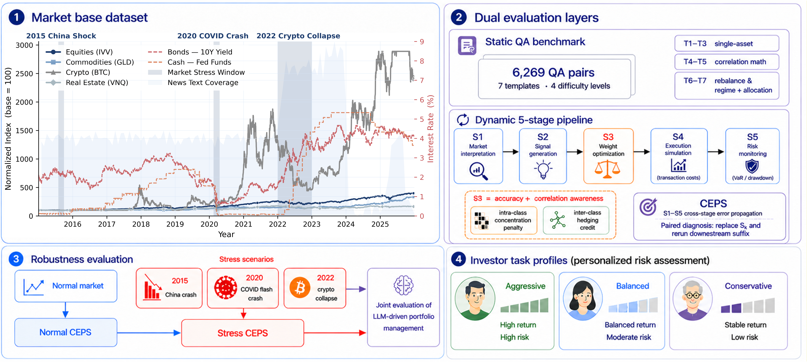

# PortBench: A Correlation-Aware, Full-Pipeline Benchmark for LLM-Driven Portfolio Management

[](https://arxiv.org/abs/2605.27887)
[](https://huggingface.co/collections/AgenticFinLab/portbench)
[](https://portbench.github.io/)

PortBench evaluates large language models on multi-asset portfolio management. It combines a ten-year market dataset, a static financial QA benchmark, and a stateful five-stage allocation pipeline covering 183 instruments across equities, bonds, commodities, real estate, cryptocurrency, and cash.

## Benchmark at a Glance

| Component | Scope | Measures |
|---|---|---|
| Market base dataset | 183 instruments, 6 asset classes, 2015--2025 | Prices, macro series, time-aligned news, and cross-asset correlations |
| Static QA | 6,269 questions, 7 templates, 4 difficulty levels | Prediction, risk estimation, sizing, allocation, rebalancing, and regime judgment |
| Dynamic pipeline | S1 market interpretation, S2 signal generation, S3 weight optimization, S4 execution realization, S5 risk realization | Stage quality, cross-stage error propagation, portfolio outcomes, and profile alignment |
| Robustness evaluation | 3 investor profiles and 3 historical stress regimes | Risk-adjusted performance and profile-specific drawdown gates |

The main pipeline ranking uses model decisions at S1--S3 and deterministic realization scores at S4--S5. CEPS combines mean stage quality with a penalty for drops between adjacent stages. S3 also scores whether allocations avoid intra-class concentration and use inter-class hedging. Paired stage interventions replace one stage output with its ground truth and rerun the downstream stages to measure within-simulator error propagation.

Across ten frontier LLMs, only 39 of 120 model--profile--period evaluations (32.5%) outperform equal weighting on Sharpe ratio. QA and balanced-profile CEPS rankings are negatively correlated (Spearman $\rho=-0.49$), showing that strong static QA performance does not reliably predict multi-stage portfolio decisions.

<p align="center">
  
</p>

## Installation

PortBench requires Python 3.11 or later.

```bash
pip install -r requirements.txt
pip install -e .
```

Copy [`.env.example`](.env.example) to `.env` and add only the credentials needed for the data sources or model providers you use.

## Quick Start

```bash
# Collect and preprocess market data
python examples/data_collect/get_all.py
python examples/data_preprocess/preprocess_all.py

# Build and evaluate the published QA benchmark
python examples/qa_builder/build_qa_dataset.py
python examples/agent_eval/run_qa_eval.py

# Run the sandbox without API keys or downloaded data
python examples/sandbox/run_backtest.py --data-provider mock

# Inspect a batch experiment without sending model calls
python -m portbench.experiments \
  --config configs/experiments/default.yaml \
  --dry-run
```

For provider configuration and full experiment workflows, see the [experiment documentation](docs/modules/experiments.md). Generated datasets and experiment outputs are stored in gitignored local directories.

## Resources

- [Market dataset](https://huggingface.co/datasets/AgenticFinLab/PortBench-Market)
- [QA dataset](https://huggingface.co/datasets/AgenticFinLab/PortBench-QA)
- [Module documentation](docs/modules/)
- [Data sources](docs/data-sources.md)
- [Live evaluation guide](examples/live/README.md)

## Citation

```bibtex
@article{zhao2026portbench,
  title={PortBench: A Correlation-Aware, Full-Pipeline Benchmark for LLM-Driven Portfolio Management},
  author={Zhao, Yuxuan and Chen, Sijia and Su, Ningxin},
  journal={arXiv preprint arXiv:2605.27887},
  year={2026}
}
```

PortBench is released under the [Apache 2.0 License](LICENSE).
