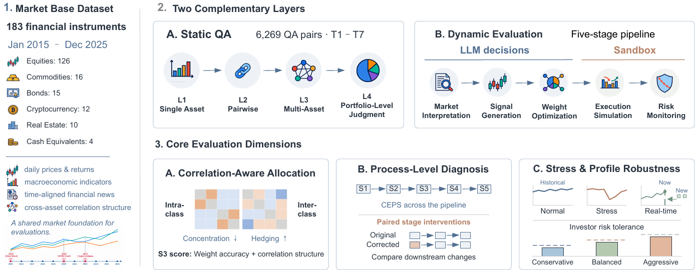
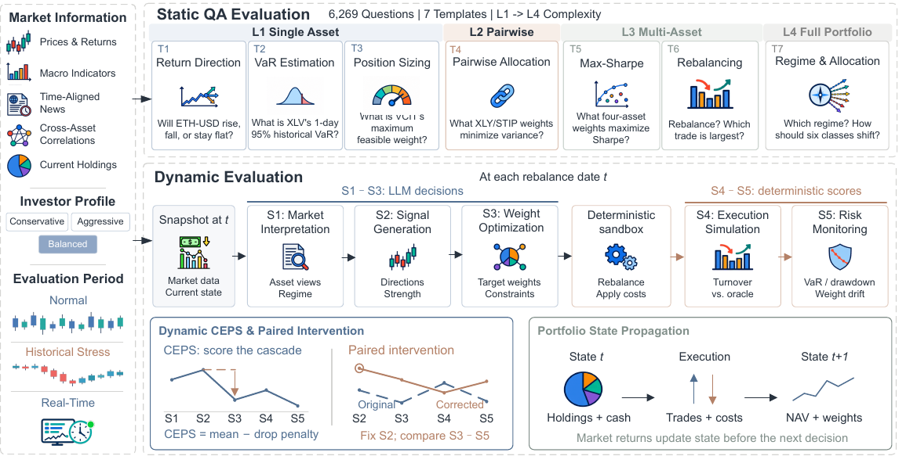

# PortBench: A Correlation-Aware, Full-Pipeline Benchmark for LLM-Driven Portfolio Management

[](https://arxiv.org/abs/2605.27887)
[](https://huggingface.co/collections/AgenticFinLab/portbench)
[](https://portbench.github.io/)

PortBench is a correlation-aware benchmark for LLM-driven portfolio management. Diversification depends on correlations within and across asset classes, but existing benchmarks are often limited to one asset class, or they score assets in isolation. They also rarely show where an error arises or how it changes the next decision. PortBench evaluates both with a 2015--2025 corpus of 183 market series across equities, bonds, commodities, real estate, cryptocurrency, and cash, a static QA dataset, and a five-stage portfolio evaluation.

## Benchmark at a Glance

| Component | Scope | Measures |
|---|---|---|
| Market base dataset | 183 series, 6 asset classes, 2015--2025 | Prices, macro series, time-aligned news, and cross-asset correlations |
| Static QA | 6,269 questions, 7 templates, 4 difficulty levels | Prediction, risk estimation, sizing, allocation, rebalancing, and regime judgment |
| Dynamic pipeline | S1 market interpretation, S2 signal generation, S3 weight optimization; S4 and S5 score the allocation | Reference-based stage scores, class-level correlation, turnover and lookback risk-state agreement |
| Robustness evaluation | 3 investor profiles, 3 stress windows, and the 2024 normal window | Sharpe versus equal weight, drawdown gates, and profile exposure |

**Key findings**:

- **No consistent Sharpe advantage over equal weighting.** Portfolios beat equal weighting on Sharpe in 65 of 120 evaluations (54.2%): 90% in 2015--16, 77% in 2020, 50% in 2024, and 0% in 2022.
- **High financial QA scores do not ensure consistent portfolio outperformance.** QA and balanced-profile CEPS rankings differ sharply (Spearman $\rho=-.32$).
- **Broad holdings still concentrate weight in correlated assets.** The allocations in 2024 hold 73 assets on average. Equalizing weights within each held class lowers estimated volatility by 8.5% (271 of 330 decisions); 76.4% of the mean variance difference comes from within-class covariance.

Details are in the [paper](https://arxiv.org/abs/2605.27887).

<p align="center">
  
  <br><em>Figure 1. A shared multi-asset market base supports static QA and dynamic five-stage evaluation. The benchmark assesses correlation-aware allocation, stagewise diagnostics through CEPS and paired interventions, and robustness across periods and investor profiles.</em>
</p>

<p align="center">
  
  <br><em>Figure 2. Static QA covers templates T1--T7. At each rebalance the LLM produces S1--S3, and the sandbox scores execution and risk at S4--S5. CEPS summarizes the reference-based stage scores, and the portfolio state carries into the next decision.</em>
</p>

## Installation

PortBench requires Python 3.11 or later.

```bash
pip install -r requirements.txt
pip install -e .
```

Copy [`.env.example`](.env.example) to `.env` and add only the credentials needed for the data sources or model providers you use.

## Quick Start

```bash
# Collect and preprocess market data
python examples/data_collect/get_all.py
python examples/data_preprocess/preprocess_all.py

# Build and evaluate the published QA benchmark
python examples/qa_builder/build_qa_dataset.py
python examples/agent_eval/run_qa_eval.py

# Run the sandbox without API keys or downloaded data
python examples/sandbox/run_backtest.py --data-provider mock

# Inspect a batch experiment without sending model calls
python -m portbench.experiments \
  --config configs/experiments/default.yaml \
  --dry-run

# Replay the published tables from frozen decisions (no model calls)
python -m portbench.published_eval replay --source-root .
python -m portbench.published_eval classical --source-root .
```

For provider configuration and full experiment workflows, see the [experiment documentation](docs/modules/experiments.md). Generated datasets and experiment outputs are stored in gitignored local directories.

## Resources

- [Market dataset](https://huggingface.co/datasets/AgenticFinLab/PortBench-Market)
- [QA dataset](https://huggingface.co/datasets/AgenticFinLab/PortBench-QA)
- [Module documentation](docs/modules/)
- [Data sources](docs/data-sources.md)
- [Live evaluation guide](examples/live/README.md)

## Citation

```bibtex
@article{zhao2026portbench,
  title={PortBench: A Correlation-Aware, Full-Pipeline Benchmark for LLM-Driven Portfolio Management},
  author={Zhao, Yuxuan and Chen, Sijia and Su, Ningxin},
  journal={arXiv preprint arXiv:2605.27887},
  year={2026}
}
```

PortBench is released under the [Apache 2.0 License](LICENSE).
